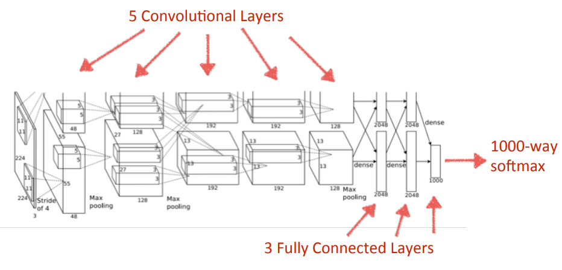

As the legend goes, the deep learning networks created by Alex Krizhevsky, Geoffrey Hinton and Ilya Sutskever (now largely know as AlexNet) blew everyone out of the water and won Image Classification Challenge (ILSVRC) in 2012. This heralded the new era of deep learning. <!--truncate-->AlexNet is the most influential modern deep learning networks in machine vision that use multiple convolutional and dense layers and distributed computing with GPU.

Along with LeNet-5, AlexNet is one of the most important & influential neural network architectures that demonstrate the power of convolutional layers in machine vision. So, let’s build AlexNet with Keras first, them move onto building it in .

Dataset

We are using OxfordFlower17 in the tflearn package. The dataset consists of 17 categories of flowers with 80 images for each class. It is a three dimensional data with RGB colour values per each pixel along with the width and height pixels.

AlexNet Architecture

AlexNet consist of 5 convolutional layers and 3 dense layers. The data gets split into to 2 GPU cores. The image below is from the first reference the AlexNet Wikipedia page here.



AlexNet with Keras

I made a few changes in order to simplify a few things and further optimise the training outcome. First of all, I am using the sequential model and eliminating the parallelism for simplification. For example, the first convolutional layer has 2 layers with 48 neurons each. Instead, I am combining it to 98 neurons.

The original architecture did not have batch normalisation after every layer (although it had normalisation between a few layers) and dropouts. I am putting the batch normalisation before the input after every layer and dropouts between the fully-connected layers to reduce over-fitting.

When to use batch normalisation is difficult. Everyone seems to have opinions or evidence that supports their opinions. Without going into too much details, I decided to normalise before the input as it seems to make sense statistically.

**Code**

Here is the code example. The input data is 3-dimensional and then you need to flatten the data before passing it into the dense layer. Using cross-entropy for the loss function, adam for optimiser and accuracy for performance metrics.

As the network is complex, it takes a long time to run. It took about 10 hours to run 250 epochs on my cheap laptop with CPU. The test dataset accuracy is not great. This is probably because we do not have enough datasets. I don’t think 80 images each is enough for convolutional neural networks. But, it still runs.

It’s pretty amazing that what was the-state-of-the-art in 2012 can be done with a very little programming and run on your $700 laptops!

```python
# (1) Importing dependency
import keras
from keras.models import Sequential
from keras.layers import Dense, Activation, Dropout, Flatten,\
 Conv2D, MaxPooling2D
from keras.layers.normalization import BatchNormalization
import numpy as np
np.random.seed(1000)

# (2) Get Data
import tflearn.datasets.oxflower17 as oxflower17
x, y = oxflower17.load_data(one_hot=True)

# (3) Create a sequential model
model = Sequential()

# 1st Convolutional Layer
model.add(Conv2D(filters=96, input_shape=(224,224,3), kernel_size=(11,11),\
 strides=(4,4), padding='valid'))
model.add(Activation('relu'))
# Pooling
model.add(MaxPooling2D(pool_size=(2,2), strides=(2,2), padding='valid'))
# Batch Normalisation before passing it to the next layer
model.add(BatchNormalization())

# 2nd Convolutional Layer
model.add(Conv2D(filters=256, kernel_size=(11,11), strides=(1,1), padding='valid'))
model.add(Activation('relu'))
# Pooling
model.add(MaxPooling2D(pool_size=(2,2), strides=(2,2), padding='valid'))
# Batch Normalisation
model.add(BatchNormalization())

# 3rd Convolutional Layer
model.add(Conv2D(filters=384, kernel_size=(3,3), strides=(1,1), padding='valid'))
model.add(Activation('relu'))
# Batch Normalisation
model.add(BatchNormalization())

# 4th Convolutional Layer
model.add(Conv2D(filters=384, kernel_size=(3,3), strides=(1,1), padding='valid'))
model.add(Activation('relu'))
# Batch Normalisation
model.add(BatchNormalization())

# 5th Convolutional Layer
model.add(Conv2D(filters=256, kernel_size=(3,3), strides=(1,1), padding='valid'))
model.add(Activation('relu'))
# Pooling
model.add(MaxPooling2D(pool_size=(2,2), strides=(2,2), padding='valid'))
# Batch Normalisation
model.add(BatchNormalization())

# Passing it to a dense layer
model.add(Flatten())
# 1st Dense Layer
model.add(Dense(4096, input_shape=(224*224*3,)))
model.add(Activation('relu'))
# Add Dropout to prevent overfitting
model.add(Dropout(0.4))
# Batch Normalisation
model.add(BatchNormalization())

# 2nd Dense Layer
model.add(Dense(4096))
model.add(Activation('relu'))
# Add Dropout
model.add(Dropout(0.4))
# Batch Normalisation
model.add(BatchNormalization())

# 3rd Dense Layer
model.add(Dense(1000))
model.add(Activation('relu'))
# Add Dropout
model.add(Dropout(0.4))
# Batch Normalisation
model.add(BatchNormalization())

# Output Layer
model.add(Dense(17))
model.add(Activation('softmax'))

model.summary()

# (4) Compile
model.compile(loss='categorical_crossentropy', optimizer='adam',\
 metrics=['accuracy'])

# (5) Train
model.fit(x, y, batch_size=64, epochs=1, verbose=1, \
validation_split=0.2, shuffle=True)
```
