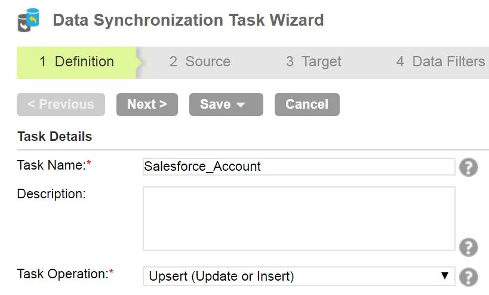
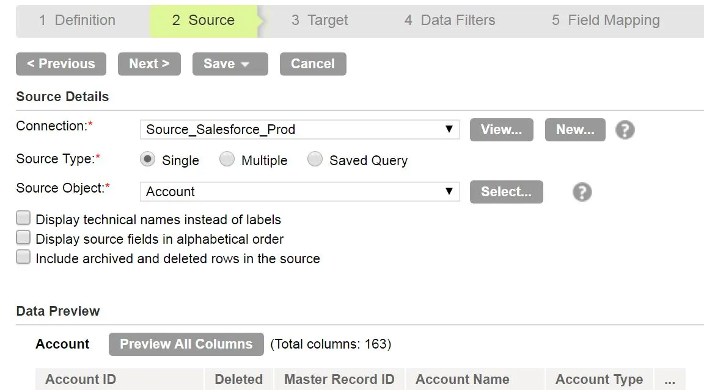
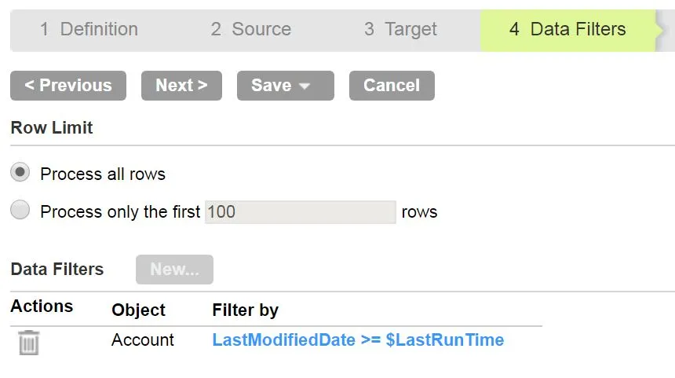

# Incremental Load With Data Synchronization Task

Data Synchronization is a great tool to ingest source data into Data Lake, ODS, or Staging Area. Currently, Data Synchronization does not read database logs to do incremental loads (this is in their road map). Instead, each task automatically stores the last run time stamp ($LastRunTime) in the default task parameter file (which can be found in the server or computer where the secure agent is installed). Implementing incremental load is simply to use $LastRunTime stored in the filter condition.

Note that $LastRunTime is stored in GMT (this does not change even if you change the timezone for your Org within Informatica Cloud). Therefore, it can be used without any change when the Source System uses GMT (like Salesforce or MarketingCloud). If the Source System uses local time, we have to convert the time stamp column in the source system to GMT in the filter condition (we will look into this case in the second example). With this approach, we can achieve near real-time integration down to 5 minutes at minimum.

Let’s have a look at three common ingestion patterns.

Incremental Upsert
Incremental Insert
Truncate and Load
Incremental Upsert

In this example, we will do incremental upsert on Salesforce Account table into a relational database.

(1) Name the task and choose operation as Upsert.

(2) Define Source by selecting the source connection (Salesforce Connection) and choose the object (Account). It will automatically read the account object.

(3) Define the Target by choosing the target database connection.

(4) Salesforce objects have a field called LastModifiedDate. This is the timestamp for the newly inserted/updated record. We will use this field to find all the records that got inserted or updated since the last time the synchronisation task was run.

`LastModifiedDate >= $LastRunTime`

(5) Map the field. Data Synchronisation can create table for you. It is sometimes a good idea to create a table by yourself and include only the fields that are relevant and Last_Uploaded_Timestamp where it indicates the last time the row was uploaded to the table by Informatica.

(6) You can schedule the task on it own or add to the task flow that has other Salesforce tasks. Informatica can schedule the job down to 5 minutes.

Incremental Insert when Source Table Uses Local Timestamp

When we ingest event tables (where only new records get inserted and existing records don’t get updated), the best approach is to grab only the records that have gotten inserted since the last run.

We are ingesting an event table from Oracle database where the application stores time in the local time (Sydney/Australia). ACTION_DTE in the source table indicate when the record gets inserted.

(1) Name the Task and choose Insert as Task Operation.

(2) Choose the source connection and table.

(3) Choose the target connection and table.

(4) In the filter, we convert ACTION_DTE into GMT with Oracle syntax (as the source database is Oracle) and use it to find the records inserted after the last run. In the Filter tab, use advanced option to write the condition.

`from_tz(cast(ACTION_DTE as timestamp), ‘Australia/Sydney’) at time zone ‘GMT’ > $LastRunTime`

(5) Map fields, configure Target Properties and set schedule.

Truncate and Load

This is not the best approach for ingesting data. However, there is always a time and place for good ol’ Truncate and Load.

To achieve this, you simply have to write the truncate table statement in Pre-sql command in the Advanced Target Properties. This can be set in the step 6 (Schedule) of the Task Wizard.

(2017-08-13)
