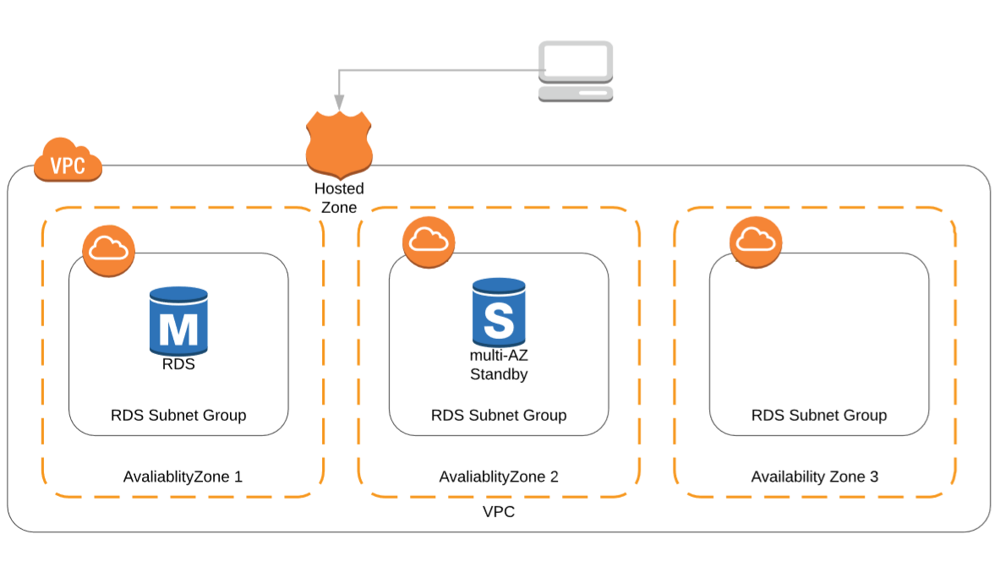
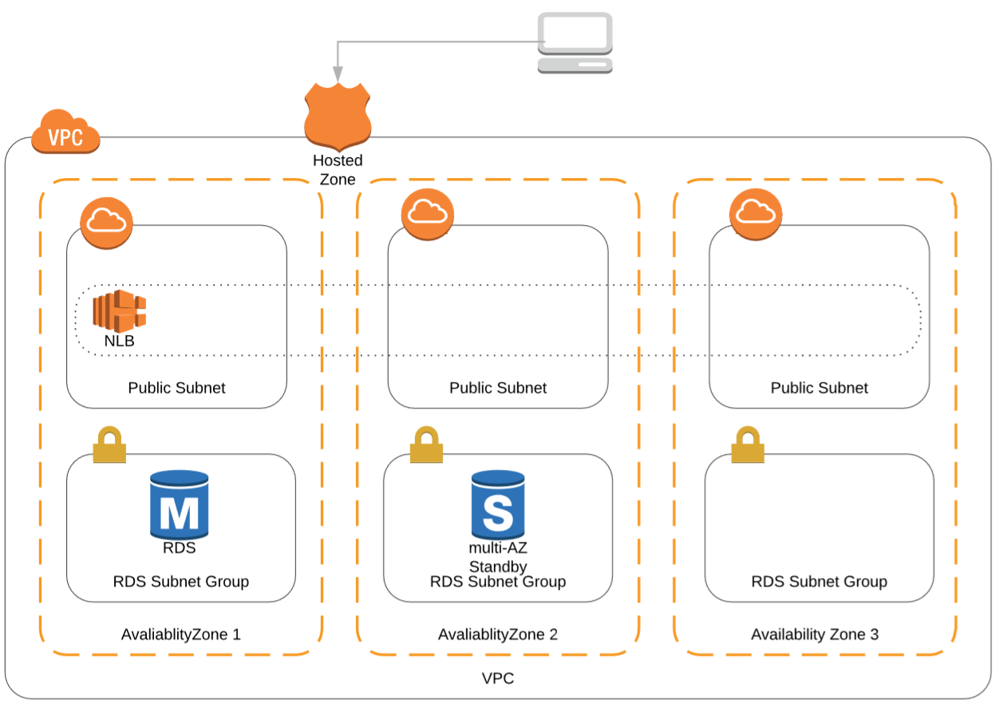

# How to Make RDS in Private Subnet Accessible From the Internet

When you have RDS in a private subnet, you cannot access from the Internet. Accessing RDS from the Internet is not necessary and is not a good practice if it is used for the application backend. However, your RDS is an analytics database and needs to be accessed by another non-AWS SaaS BI applications, the database should be accessed from the Internet. When you decide not to implement Direct Connect between your production environment and corporate network, people in the office need another way to query the database for analytics work.

There are many ways to implement this. Here are two simple approaches for above-mentioned data access requirements to be met.

Accessing RDS in the private subnet through Network Load Balancer
Create NLB in the public subnets across all the availability zones. Target should be the IP address and the port of the RDS instance. If you want to use DNS, you can map the alias as the load balancer in the hosted.

As for security, it is always recommended to implement SSL. The most secure way is to use 2 factor authentication by using a client-side certificate. If the maintenance of certificate and configuration feels too heavy for the security requirements, forcing SSL should be enough. This depends on your company’s security requirements.

It is also important that RDS has the security group that allows access only from the required IP ranges.

Here is the diagram.

You can check how this is created by CloudFormation from the next post (Creating Publicly Accessible RDS with CloudFormation).

Put RDS in the public subnet
This is the simplest solutions. In fact, the first solution feels like a workaround and becomes difficult if you want to automate stack creation by CloudFormation (this is because RDS attribute in CloudFormation does not return IP address of RDS). If you implement a good security measure with SSL, ACL and security groups, it can meet your ubiquitous data access needs in a secure fashion.

Here is the diagram.

I have seen both architectures to be used in the real world. There are always pros and cons. At the end of the day, we all know there is no perfect solution to fit all. The choice of the architecture is really ‘it depends’.

Let us know if you have done other ways to make RDS publicly accessible!

(2018-07-08)
