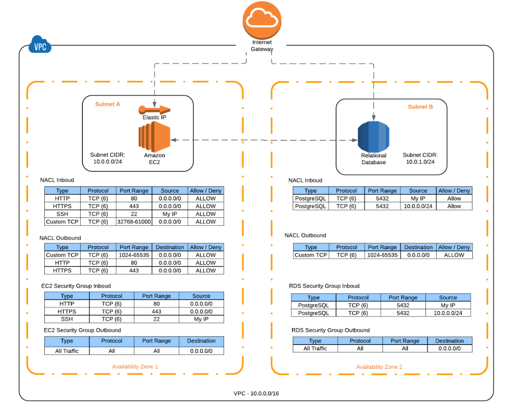

# How To Configure Network Access Control Lists (NACLs) and Security Groups in AWS

After setting up VPC, Internet Gateway, Subnets, Route Tables (see here), we need to set up Network Access Control Lists (NACLs) for the subnets and Security Group for EC2 and RDS.

This is a step in How To Create Your Personal Data Science Computing Environment In AWS.

NACLs are at the subnet level. It is stateless and you need to specify both inbound and outbound rules. In short, stateless means the security wall doesn’t remember which packet enters the network and the packet gets dropped when it is leaving without explicit outbound rule.

On the other hand, Security Groups are at the instance level. It is stateful and you only need to configure inbound as it remembers which packet enters the network.

According to the use case here, I have the detailed rules.

You can configure NACLs and Security Groups from VPC console as below.

Detailed Plan

Notes

There are a few things that got me when I was setting this up.

Custom TPC port range for NACL inbound rule is required to download stuff from the Internet into EC2 instance. These ports are for the packet coming back to the instance when EC2 make requests to the internet.
Between subnets, you can use the subnet IP range. See the NACL inbound and Security Group rules for RDS. The second rule is for EC2 to cross the subnet.
Cool. Now you have Network ACLs and Security Groups configured.

Let’s go back to How To Create Your Personal Data Science Computing Environment In AWS to complete the rest of the steps!

(2018-01-27)
