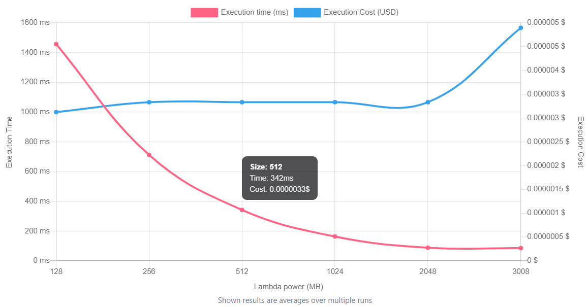

# How To Optimise Memory Allocation For Lambda Functions

In terms of computing, the lambda has only one parameter to tune, memory allocation. We can allocate any amount of memory between 128MB and 3008MB to your function today. The amount of memory you allocate is proportional to the amount of CPC allocated for the function. The lambda pricing is based on the amount of memory allocated and the execution time.

The more memory you allocate, the more you get charged. This does not mean giving your function less memory costs less. Because less memory allocation means less CPU, the function runs slower, and hence you may get charged more.

To optimise the cost and performance for your lambda function, you need to find the sweet spot for the memory allocation. Finding the optimal memory amount manually is not easy. At the moment, you can set your memory in 64MB increments from 128MB to 3008MB. There are 64 variations.

Luckily, there is an open-source tool created by an AWS engineer that runs your lambda function with different memory configurations (see aws-lambnda-power-tuning). It gives you the optimal memory allocation according to your need. There are three options for optimisation, cost, speed and balanced (between cost and speed). With balanced mode, you can even put weight on whether you care more about cost or speed (or put 0.5 for both).

AWS lambda power tuning is basically the step functions. It will invoke your lambda with multiple power configuration, analyse the logs and suggest the best configuration. It will also give you the URL for the graph that shows performance and cost in relation to different memory amounts.

Deployment is fairly simple. You can use AWS serverless application repository, SAM CLI, AWS CDK or Lumigo CLI (instruction is here). Then you can start execution with adding a config JSON through the console. The full documentation for the config options is here.

For example, I gave the execution config as below to find out most balanced memory allocation for my lambda. When you put strategy as balanced, it will give you 0.5 for cost and performance by default.

The payload is an event data. For example, if the function is triggered by S3 Put request, we have to add event data there.

```json
{
  "lambdaARN": "my-lambda-arn",
  "powerValues": [128, 256, 512, 1024, 2048, 3008],
  "num": 10,
  "payload": "{\"Records\":[{\"eventVersion\":\"2.0\",\"eventSource\":\"aws:s3\", ...",
  "parallelInvocation": true,
  "strategy": "balanced"
}
```

This will give you the output below. Power means the recommended memory allocation for the strategy you choose. In this instance, the recommended amount is 2048MB.

```json
{
  "power": 2048,
  "cost": 0.0000033328,
  "duration": 88.21499999999999,
  "stateMachine": {
    "executionCost": 0.0003,
    "lambdaCost": 0.00021579880000000004,
    "visualization": "https://lambda-power-tuning.show/{some hashed value}"
  }
}
```

The visualisation URL will take you to the dashboard. It will not send any information regarding your lambda function except the cost and performance data and is safe.

The visualisation really helps you to find out the outcome. As you can see below, the cost does not increase until 2048MB, but the execution time decreases significantly up to the amount. Above 2048MB, there is not much performance gain while the cost goes up. It looks like 2048MB is the best memory allocation for this function.



Optimising memory allocation for lambda is easy and fun with AWS lambda power tuning. This works for any lambda function with any event source and any language. You should try it and let us know how you went!

(2020-08-10)
