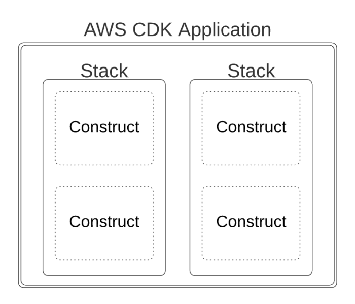

# Getting Started with AWS CDK with TypeScript

There is something really delightful about using actual programming language to code infrastructure. AWS CDK allows us to write infrastructure code in a totally different way from writing YAML or JSON type of code like CloudFormation or Terraform. The infrastructure code feels more familiar and it is more fun if you are a programmer.

Getting started with AWS CDK is fairly simple as long as you have previous experience with other tools to code AWS infrastructure. In the end, the code gets converted to CloudFormation, just like any other tools. It is more concise and pleasant than writing native CloudFormation code because we can use everything comes with a programming language, like loop, conditions and so on. The code structure becomes cleaner, too.

In this post, I want to show you the steps to create a project with TypeScript. For the actual code example, you can check out my repo here.

AWS CDK Code Structure

AWS CDK organises code into App, Stack and Construct. An app contains stacks. The stack is the unit of deployment. Each stack is equivalent to a CloudFormation stack. With CDK, we can deploy multiple stacks. Each stack contains constructs. A construct is a group of resources. For example, it can contain EC2 and load balancer. The main resource creation logic goes to constructs.

So, this is the simple code structure diagram.



Setting up a project

Let’s set up a TypeScript project. The basic project can be set up with command line tool. Then, we can create folders to make it a little bit cleaner.

(1) Install AWS CDK

AWS CDK is a command line tool that can be installed by npm.

`npm i -g aws-cdk`

(2) Create a template

Once CDK is installed, we can create a template for TypeScript. cdk init will name the app and stack from the folder name where the project is created. Of course, the names can be changed.

`cdk init --language typescript`

(3) Create a folder structure

When you initialise the project, it creates a bunch of files with all the configuration done. It has App and Stack. However, the initial project does not have any construct. We move the stack file to a stacks folder and create a constructs folder where we can write our construct.

The bin folder contains the entry file that instantiate App().

```bash
- bin
  - myapp.ts
- lib
  - constructs
    - mykinesis.ts
    - mylambda.ts
  - stacks
    - mysimplestack.ts
```

(4) Create constructs and instantiate it in the stack class

In the stack code which extends cdk.Stack, you can see the comment the code that defines your stack goes here. That is where we can instantiate construct classes.

```ts
// The code that defines your stack goes here
new MyKinesis(this, id);
new MyLambda(this, id);
```

(5) Deploy

We can deploy the stack now. You may need to do cdk bootstrap if it throws error first time. The error message gives you the instruction on how to do cdk bootstrap. So you can follow it just in case you get error.

`cdk deploy`

Now you can check the simple CDK example that creates lambda function here. I have a little bit more complex example that creates S3, Kinesis and Kinesis firehose here.

(2020-07-31)
