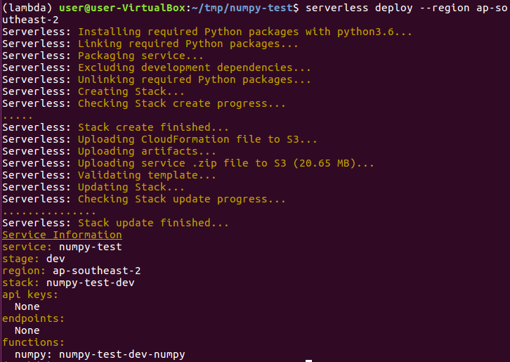

# How to Deploy Python Lambda Function with Serverless in AWS (Introduction)

To deploy a AWS lambda function written in Python, you need to package all the modules that are used in your code before pushing it to your environment. Serverless is a great lambda deployment framework. It takes care of all the packaging and deployment.

With Python, the best approach to develop lambda function is to use Linux or Mac. I found the module installed and packaged from Windows machine sometimes doesn’t work once I pushed to AWS. Serverless needs Docker. Docker and Serverless do not work very well on Windows. I had so much trouble configuring my Windows machine to make them work together. So, my approach is to run a Linux machine in a virtual box from Windows and develop and deploy lambda functions from there. In this post, I am using Ubuntu 16.0.4 LTS.

Prior to this, you have to set up the environment: Setting up Docker and Serverless Development Environment in Ubuntu.

This post is based on the serverless blog (How to Handle your Python packaging in Lambda with Serverless plugins) with a few additional information. The instruction provided there is great. But, it is missing a few minor details which may become difficult if you have no idea what serverless does. Well, let’s get started.

**Steps**

(1) Create and Activate Virtual Environment for Lambda Development

Make sure that you have the latest Python 3. You can name your virtual environment whatever. Here, we are using the environment called lambda. You can change the path to lambda, depending on your installation. To install Python 3 and create virtual environments, see the post here.

`source /home/user/python3/lambda/bin/activate`

(2) Install Required Packages

In this exercise, we will use numpy. Let’s also install psycopg2 and import it in the code to see how it works, too. For Lambda function, you need to install the binary version of psycopg2. Once you activate the virtual environment, pip will install the packages into that environment.

```bash
pip install numpy
pip install psycopg2-binary
```

(3) Go to the folder where you create Serverless project.

I created a tmp folder in my home path (`/home/user/`).

`mkdir /home/user/tmp/`
(4) Create Python Serverless Project

Go to the tmp folder created above and create project. If you set the path argument to numpy-test as in the example, it will create the folder. If you already have the folder with the same name, it will give you an error.

Then, you can create a requirement file which contains the versions of the packages installed in your environment.

```bash
cd /home/user/tmp/

serverless create \
--template aws-python3 \
--name numpy-test \
--path numpy-test
```

After creating the project go into the numpy-test folder and create a requirement file which contains the versions of the packages installed in your environment by using pip freeze.

`pip freeze > requirements.txt`
(5) Create Function

After running serverless create command, you will see handler.py in the numpy-test folder. Let’s edit it as in the example here with additional psycopg2 import statement. Test the function to see if it works.

```python
import numpy as np
import psycogp2

def main(event, context):
    a = np.arange(15).reshape(3, 5)

    print("Your numpy array:")
    print(a)

if __name__ == "__main__":
    main('', '')
```

(6) Add serverless-python-requirements plugin.

You need to install the node package as below.

```bash
npm init
npm install –save serverless-python-requirements
```

(7) Edit serverless.yml file

Once the function is working, you need to edit the config file for deployment. The file, serverless.yml, is in the lambda-test folder. You need to edit functions and add plugin information.

```yml
service: numpy-test

provider:
  name: aws
  runtime: python3.6

functions:
  numpy:
    handler: handler.main

plugins:
  - serverless-python-requirements

custom:
  pythonRequirements:
    dockerizePip: non-linux
```

(8) Deploy the function

The most important thing about this step is to specify the region. Without the region, it will deploy the function to US East (N. Virginia). See the further information on serverless deploy command here.

Serverless deploy --region ap-southeast-2
You can see the deployment is complete.



(9) Test the function from AWS Management Console

Go to AWS Management Console to see if you have numpy-test function. By default, it is tagged as dev, which means the name of your function is numpy-test-dev-numpy.

Create an event with no parameter (and name it as numpy) and click Test.

(2018-03-04)
