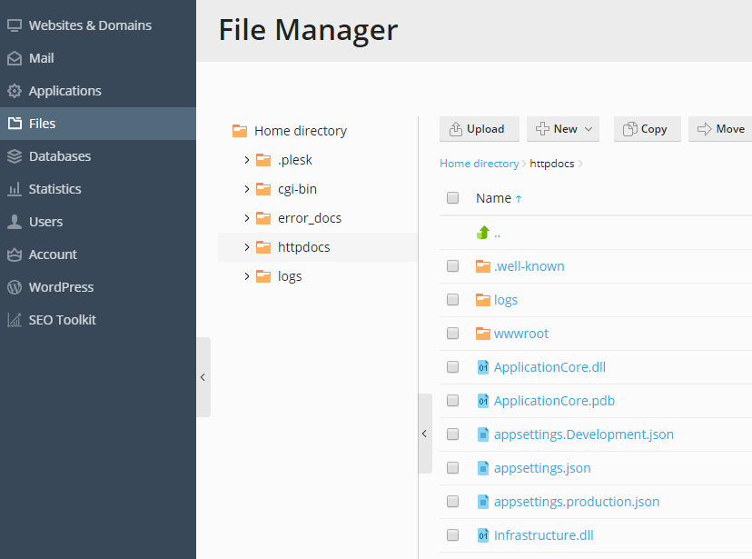

Ok, you developed a cool APS.NET Core website. Now, it’s time to get it out to the world. There are many hosting options out there. You can take a more hands-on approach like deploying to AWS or Azure. Or, you can use the hosting service provider without any hustle of cloud management.

I recently build an website in ASP.NET Core for fun (mypwa.tech) and decided to go with a hosting provider option. In fact, I’ve never hosted my own personal ASP.NET website before. I always had my personal website in PHP. As I am fairly comfortable with AWS and the .NET application at work is hosted on AWA, I initially thought of hosting it in AWS with a Linux Docker container.

Considering the scale of my website, it is probably an overkill. AWS is not exactly cheap. After doing my research, I decided to go with an ASP.NET hosting provider, InterServer.

After reading this and you feel like it is the right option for you, You can sign up from here. Before going any further, I am very happy about my choice.

InterServer was chose by the best 2019 ASP.NET hosting provider according to HostingAdice.com. When I further check out what they are offering, it looked good. It offers affordable hosting service price (about $5 per month) and 10GB of SQL server was attractive to me. If I was going to build an ASP.NET app, I really wanted to use it.

So, I signed up.

The web hosting can be fully managed by a nice control panel, plesk. You don’t really need to learn much. The control panel is intuitive enough to find what you want.

What made it easy was the customer service. If you are not sure about anything, just raise a service ticket. You will get a reply within a few hours. I raised about 10 tickets to understand how it all works. Chat is slow and not that great. If it is too technical, they will tell you to raise a ticket anyway. But, getting my questions answered quickly really made everything easy.

Here is the gist of what I like about InterServer.

Easy to set up database (SQL Server or MySQL) and connect to it from my local machine.
Easy to create SSL certificate and set up https.
Easy to deploy
Fairly fast feedback from customer services.
How To

Let’s get down to the business. Here is how you can set up your website.

(1) Go To Plesk

Everything happens in here. Just login to Plesk under Webhosting tab.

(2) Create Database

You can now create a database. Make sure to add your local machine’s IP address to the access allowed IP address list so that you can connect to it. I created a SQL Server database, connected to it and ran SQL scripts to create schema, tables and inserted initial set of data.

For SQL Server URL is the same as the Host Server domain name (which will not be told from the connection details from the database). It’s hosed in the same host.

(3) Drop your code into the httpdocs folder

You do not need to have server access. You can simply drop everything into httpdocs folder under Files in the console. I actually prefer doing it through FTP and copy & paste entire content from my local website folder. You can set FTP access from Websites & Domain.

Make sure to aspsettings.json has the right connection string when you drop it.

(4) Set up SSL

SSL certificate is free. The easiest way is to use the Let’s Encrypt service. Once you add the certificate, https will work. I had a problem with setting up a certificate. When I raised a ticket, it got resolved in a few hours.

That’s it. Now you have your ASP.NET Core app running in the wild.

My advice is just to raise a ticket if you have any question or trouble. Don’t bother googling it. They will help you out. In fact, it took me only half a day to figure everything out. The website & database performance seems to be OK.

(2019-12-29)
