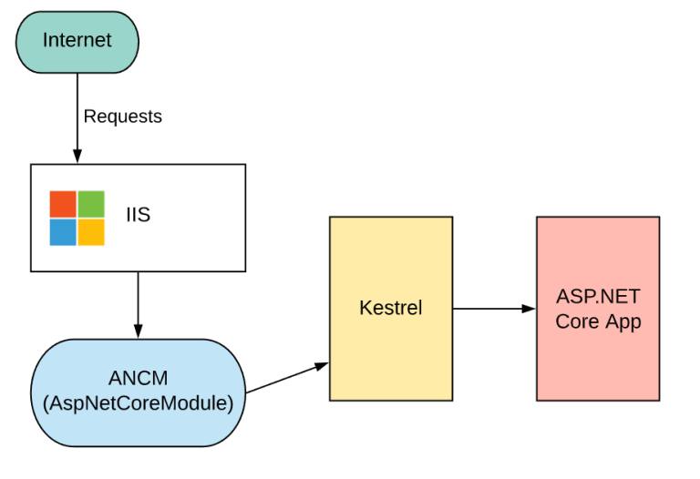
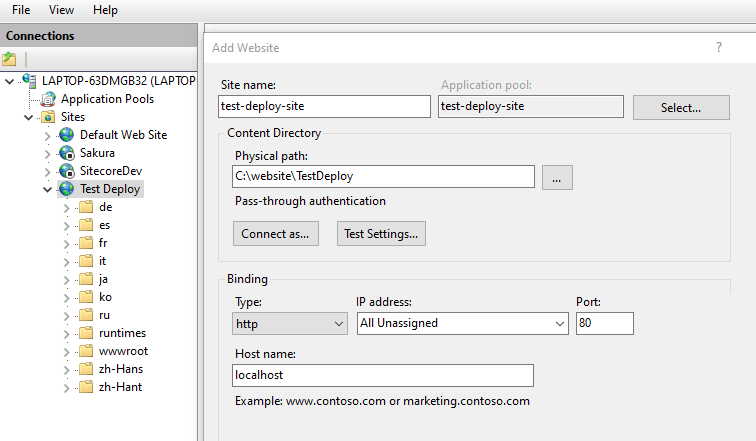
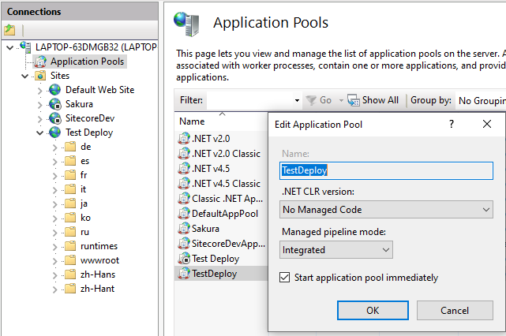

# How to Deploy ASP.NET Core Application to Windows with IIS

An ASP.NET Core application is hosted on Kestrel on both Windows and Linux. Kestrel is a web application server (just like Tomcat or NodeJS). It is included by default in ASP.NET Core project templates.

Although ASP.NET Core application can run solely run on Kestrel, it is recommended to use it with a reverse proxy server. This is a typical web application pattern where the request first hits the reverse proxy server and then gets forwarded to the application server in the background. The popular examples of the reverse proxy servers are IIS, Nginx, or Apache.

In a Window’s environment, IIS is the one that forwards requests to Kestrel. In a Linux environment, we can configure Nginx as a reverse proxy and use Kestrel to run the application.

The ASP.NET Core Module (ANCM) handles this request forwarding process management. You can see ANCM is configured in web.config file in the web root folder under handlers in system.webServer.

Here is the simple diagram for ASP.NET core application hosting architecture.



In this post, let’s deploy an ASP.NET Core application to the local Window’s IIS server. Deploying it to IIS is very simple on Window’s machine.

Summary Steps

Here are what you need to do.

Enable IIS if it is not enabled already on your machine.
Install .NET Core Windows server hosting bundle.
Add website to IIS
Update an app pool config
Publish code to web root
Steps

(1) Enable IIS

This step is often referred to as installing IIS. On the Windows machine, it is just ticking a few boxes.

Go to Turn Windows features on or off and select IIS and IIS Management Console. See IIS configuration on this documentation for further details.

(2) Install .NET Core Windows server hosting bundle

The package includes .NET Core runtime as well as the ASP.NET Core module for IIS. For .NET Core 2.2, go to this page to install Hosting Bundle.

You need to make sure you have SDK for 2.2 and your app is on the same version as the hosting bundle. If the version is different, the app will not run.

Once the bundle is installed, run iisreset to restart IIS.

(3) Add Website to IIS

Open IIS Manager and add website. Physical path is the one where you want to publish your visual studio project. For now, we can leave IP address as All Unassigned with port 80. Host name can be a local host.



(4) Configure App Pool option

Once the website is added, IIS also create a new app pool. For a dotnet core application, we need to modify the setting for this new app pool.

As mentioned at the start, IIS is not running the app for ASP.NET Core. It is simply forwarding the request and running .NET code is handled by Kestrel. Therefore, you need to set .NET CLR version to No Managed Code.



(5) Publish your app from Visual Studio

Publishing your app from Visual Studio to the web root folder is all you need to do. Then, you can go to http://localhost:80. You will see your website.

Yay!

Wait…

Here is more

(6) Create data protection registry key (optional)

Another thing you may need to consider is to set up data protection. ASP.NET Core uses the data protection API to encrypt and store keys for authentication in your app. When hosting app with IIS, you need to run a PowerShell script to create a registry hive for these keys. Otherwise, the key will be regenerated when you restart your app. It will invalidate any user sessions or cookies that were encrypted with the previous key.

The script is a GitHub repo, which is linked from the Create Data Protection Registry Keys section in the official documentation. You can run the script with the name of the script with the name of the website you created as an argument. It will set everything up for you.

```bash
.\Provision-AutoGenKeys.ps1 NameOfMyWebsite
```

Additional Tips

Publishing with PowerShell Command

It is nice to know how to use commands to publish an application for automation. First go to the project directory. Once you run the publish command, you will see all the binaries are build in the bin/Release folder. This can be moved to the web root folder for deployment.

```bash
# restore the packages
dotnet restore

# check if it builds…
dotnet build

# build application to bin/Release folder.
dotnet publish -c Release
```

What is Web.config file for?

ASP.NET Core does not use Web.config. It was used in the older versions. .NET Core now uses a new configuration model based on appsettings.json. However, the file is still needed because it is used for IIS to configure ASP.NET Core module. Otherwise, IIS cannot forwards the request correctly to Kestrel.

When you publish your app, Web.config is generated automatically in the web root folder. You do not need to touch it.

(2019-11-24)
