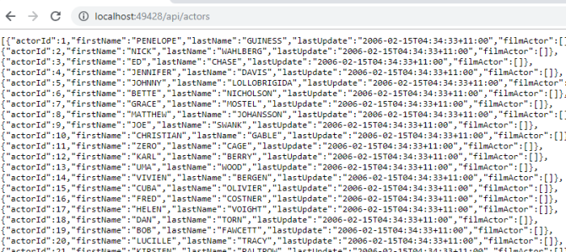

# Creating Web APIs using ASP.NET and MySQL in 5 minutes

Creating a web API that interact with a database with C# is quite easy thanks to ASP.NET and Entity Framework. Building API with ASP.NET is essentially creating a MVC application without View. If you learn how to create a website with ASP.NET, you can apply the skills directly to API building.

Entity Framework is a dotnet version of object-relational mapper (ORM) that gives you a nice abstraction layer to interact with relational databases. With Entity Framework, you do not need to write a single line of SQL. Tables become classes and SQL queries become methods that you can implement purely with C#.

With the power of .NET framework and tools, we can create a web API that interact with a database in 10 minutes. While .NET Framework only runs on Windows, .NET Core is a cross-platform framework, which can run in any OS (even in Linux).

Let’s get started.

Prerequisite

In this scenario, we are using MySQL as a back-end database. We are going to use sakila database that comes with MySQL community edition installation. Once you install MySQL, you can create a user. We also assume that you have the latest .NET Core and Visual Studio installed.

Steps

(1) Create a Web API project

When you create a .NET Core Web Application project in Visual Studio, you can choose different template types. Choose .NET Core Web Application and then choose Web API, it comes with the example API. We will build our API on top of this. Name the project as ApiIn10Minutes. Your time starts now!

(2) Install Dependencies

There are two packages you need to install, MySql.Data.EntityFrameworkCore and Microsoft.EntityFrameworkCore.Tools. Open the Package Manager Console, get into the project directory and run dotnet add package as below. Make sure to restore it after you install them.

```bash
cd ApiIn10Minutes
dotnet add package MySql.Data.EntityFrameworkCore
dotnet add package Microsoft.EntityFrameworkCore.Tools
dotnet restore
```

(3) Import the model from sakila database

The EntitiyFrameworkCore.Tools package gives you useful command-line tools. With a single line of command, it will create a model and DbContext from a chosen database. Check this out.

```bash
Scaffold-DbContext "Server=localhost;Port=3306;Database=sakila;Uid=myusername;Pwd=mypwd;" MySql.Data.EntityFrameworkCore -OutputDir Models
```

(4) Remove OnConfiguring Method in sakilaContext.cs

When you go into the newly created DbContext, sakilaContext.cs, in the Models folder, you will find the warning: To protect potentially sensitive information in your connection string, you should move it out of source code. See http://go.microsoft.com/fwlink/?LinkId=723263 for guidance on storing connection strings.

Let’s remove OnConfiguring() from the file and we will make it cleaner in the next few steps.

(5) Add the connection string in appsettings.json

Just above Logging, add the connection string as below.

```json
{
"ConnectionStrings": {
"SakilaDatabase": "Server=localhost;Port=3306;Database=sakila;Uid=myusername;Pwd=mypwd;"
},
"Logging": {
"IncludeScopes": false,
```

(6) Add DbContext to ConfigureServices()

Then, you need to configure the DbContext by adding sakilaDbContext to the service just above services.AddMvc(). This will inject sakilaDbContext into the controller. This is much better than using OnConfiguring method.

Any red line you see in the code, just right click and press refactor to add necessary package import statement at the top.

```csharp
public void ConfigureServices(IServiceCollection services)
{
  services.AddDbContext<sakilaContext>(options =>
      options.UseMySQL(Configuration.GetConnectionString("SakilaDatabase")));
  services.AddMvc();
}
```

(7) Create a controller

Create a controller called ActorsController.cs in the Controller folder by clicking add controller. It will already has a scaffold.

Add the route above the class, create private property \_context, add constructor with context as an argument, and convert Actor to array in the return statement with Ok() instead of View().

```csharp
namespace ApiIn10Minutes.Controllers
{
  [Route("api/[controller]")]
  public class ActorsController : Controller
  {
    private sakilaContext _context;

    public ActorsController(sakilaContext context)
    {
        _context = context;
    }

    public IActionResult Index()
    {
        return Ok(_context.Actor.ToArray());
    }
  }
}
```

(8) Run and Test

Run the project. The browser will show you the API from ValuesController. You can change the path to /actors.

Check this out!



Good times!

Next Step

We can refactor this code and write a unit test on this. If you are interested, check out the post here!

The complete Actor API code and unit test code examples can be found here.
