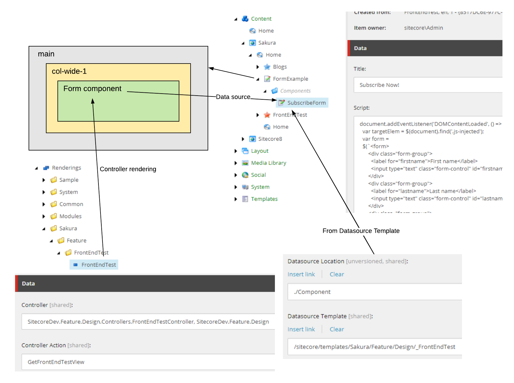
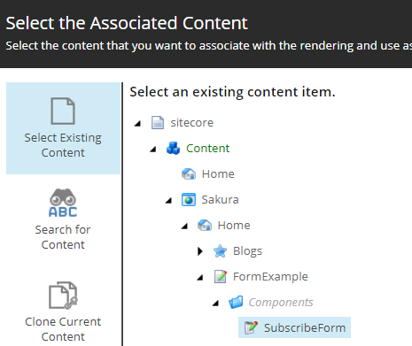
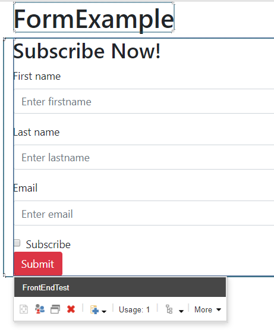

# Using Data Source in Controller Renderings

Data source for Sitecore component provide data points to be used in the components, such as controller renderings or view renderings. Content author can easily edit those data points (e.g. header title, body text or CSS style) to customise components. It is one of the techniques to make Sitecore component customisable. Data source can be assigned to a component.

Another advantage of using data source is that it makes it easier to create AB test or personalised content. Out of the box, Sitecore provides the ability for a component to reference different data source items and swap according to the rules.

In fact, we will create an AB test based on this component in the next post – How to Set up Content Tests with Data Source

To use data source, the component should reference to a template with or without default values. Actual data points are stored as items. Therefore, the component needs to know the location (folder) of the items.

In this post, we are going to create a controller rendering to render form with data source items. The template for the data source has two fields, Title as single-line text and Script as multi-line text. A form gets injected by writing JavaScript in the multi-line text field.

First, we need to create a template for the data source. Then, create a controller rendering that reference data source location and data template.

Once the page is created, it will have a folder template with data source.

Below is the summary diagram of how everything puts together.



In experience editor, we can add form component to the placeholder, col-wide-1. Make sure that the placeholder includes FrontEndTest as an available control.


As the component has data source, you can select an associated content once you insert the component. To insert associated content, you can click database plus icon on the component.



Form will be rendered.



Let’s check out the code.

FrontEndTest.cshtml

This is the razor view.

```csharp
@model SitecoreDev.Feature.Design.Models.FrontEndTest

@if (Model != null)
{
    <h2>@Model.Title</h2>
    <div class="js-injected"></div>
    <script>@Html.Raw(Model.Script)</script>
}
FrontEndTest.cs

We need a model to pass data to the view.

public class FrontEndTest
{
    public string Title { get; set; }
    public string Script { get; set; }
}
```

FrontEndTestRepository.cs

Controller gets the data source ID from the current rendering context. Repository access database to retrieve the value based on a data source id.

```csharp
namespace SitecoreDev.Feature.Design.Repository
{
    public class FrontEndTestRepository : IFrontEndTestRepository
    {
        private readonly Database _database;
        private readonly FrontEndTest _frontEndTestModel;

        public FrontEndTestRepository()
        {
            _database = Context.Database;
            _frontEndTestModel = new FrontEndTest();
        }

        public FrontEndTest GetFrontEndTestModel(string dataSourceId)
        {
            try
            {
                var item = _database.GetItem(new Sitecore.Data.ID(dataSourceId));
                _frontEndTestModel.Title = item["Title"];
                _frontEndTestModel.Script = item["Script"];
            }
            catch (Exception ex)
            {
                Sitecore.Diagnostics.Log.Error("Error in GetFrontEndModel()", ex, this);
            }

            return _frontEndTestModel;
        }
    }
}
```

FrontEndTestController.cs

This should be fairly straight-forward. RenderingContext.Current.Rendering.DataSource will return the data source Id in string. It will be cast as ID object in the repository to call GetItem().

```csharp
using System.Web.Mvc;
using Sitecore.Mvc.Presentation;
using Sitecore.Mvc.Controllers;
using SitecoreDev.Feature.Design.Repository;
using SitecoreDev.Feature.Design.Models;

namespace SitecoreDev.Feature.Design.Controllers
{
    public class FrontEndTestController : Controller
    {
        private IFrontEndTestRepository frontEndTestRepository;

        public FrontEndTestController (): this(new FrontEndTestRepository())
        {
        }
        public FrontEndTestController(IFrontEndTestRepository frontEndTestRepository)
        {
            this.frontEndTestRepository = frontEndTestRepository;
        }
        public ViewResult GetFrontEndTestView()
        {
            var dataSourceId = RenderingContext.Current?.Rendering?.DataSource;
            var viewModel =
                dataSourceId != null
                ? frontEndTestRepository.GetFrontEndTestModel(dataSourceId)
                : new FrontEndTest();

            return View("FrontEndTest", viewModel);
        }
    }
}
```

Scripts.js

Finally, this is the script in the multinet text field which injects form into the page.

```js
document.addEventListener("DOMContentLoaded", () => {
  var targetElem = $(document).find(".js-injected");
  var form = $(`<form>
      <div class="form-group">
        <label for="firstname">First name</label>
        <input type="text" class="form-control" id="firstname" 
                name="firstname" placeholder="Enter firstname">
      </div>
      <div class="form-group">
        <label for="lastname">Last name</label>
        <input type="text" class="form-control" id="lastname" 
                name="lastname" placeholder="Enter lastname">
      </div>
      <div class="form-group">
        <label for="email">Email</label>
        <input type="email" class="form-control" id="email" 
                name="email" placeholder="Enter email">
      </div>
      <div class="form-check">
        <input type="checkbox" name="subscribe" class="form-check-input" id="subscribe">
        <label class="form-check-label" for="subscribe">Subscribe</label>
      </div>
      <button type="submit" class="btn btn-danger">Submit</button>
    </form>`);
  form.insertAfter(targetElem);
});
```

Next steps
Let’s use this component to create an AB test. Creating a content test in Sitecore is easy when the component is set up correctly. Check this out: How to Set up Content Tests with Data Source.
Before creating the test, we should create the custom goal can be triggered by AJAX call – check out this post for custom goal creation: : How to Set up Content Tests with Data Source.

(2019-8-14)
