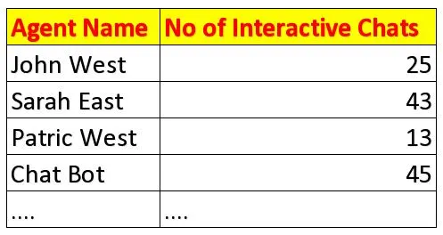

# How To Ingest Data From Liveperson With Python

Engagment History API let you grab livechat interaction data from Liveperson. It is based on the REST architecture and uses OAuth1.0. You first need to retrieve API Keys. In this example, I am using the requests and requests_oauthlib modules to make API calls from Python. Liveperson offers a good code examples and this is a good place to start.

The resulting JSON file include all the attributes associated with live chat activities (like agent stats, customer feedback, transcripts, customer’s behaviour on the website and so on). To convert it into structured tables, you need to create a data model. CSV files can be inserted into a database.

If you are interested in using Liveperson with R, check out this post: How To Get Liveperson Data With R.

**Data Model**

In the info node, you can find ‘engagementId’. All the tables can be tied with this. I also think it is a good idea to bring ‘startTime’ from the info node into all the tables. Depending on how your Liveperson is configured, the number of tables would be different. But, you always need a base table which contains unique engagement id per row so that you can create one to many relationships.

In this example, I choose interaction and post chat survey tables for simplification. The interaction table has a primary key engagement_id. Post chat survey typically contains multiple questions. This means one interaction can have many post chat survey records. We will add the engagement_id as the foreign key to the interaction table to handle this one-to-many relationship. By using the same method, you can create a data model for all the attributes.



Gocha!

The start and end date parameters are in epochtime millisecond. The function convert_to_epochtime converts date in string into epochtime.
Some of the timestamp fields has epochtime. I created a function to convert epochtime back to timestamp.
API limit is 100 records. We need to increment offset parameter in while loop until we get all the records.
Some field does not exist all the time, which requires you to handle the key error with try-except (for example, ‘mcs’ in the interaction node).
It is better to use pipe instead of comma because some values contain comma.
Let’s put them together. Here it comes!

Code

```python
import requests
from requests_oauthlib import OAuth1
from requests_oauthlib import OAuth1Session
import time
import json
from datetime import datetime
import sys

# (1) Enter date_string in 2000-01-01 format and convert to epochtime millisecond
def convert_to_epochtime(date_string):
    try:
        epoch = int(time.mktime(time.strptime(date_string, '%Y-%m-%d'))) * 1000
        return epoch
    except ValueError:
        print('Invalid string format. Make sure to use %Y-%m-%d')
        quit()

# (2) This function converts epochtime to timestamp
def epoch_to_stamp(epochtime):
    return time.strftime('%Y-%m-%d %H:%M:%S', time.gmtime(epochtime/1000.0))

# (3) create a table according to header and table_name
def create_table(header, table_name, staging_table_lst):
    write_file = './' + table_name + ".csv"
    file = open(write_file, 'w')
    file.write('|'.join(header)+ '\n')

    for i in staging_table_lst:
        for j in range(0, len(i)):
            file.write('|'.join(i[j]) + '\n')
    print("Created {}.csv".format(table_name))

# (4) Methods to create tables
def staging_interaction(results):
    '''This method is for staging interaction table per export'''
    outcome = []
    for i in results['interactionHistoryRecords']:
        tmp = []
        tmp.append(str(i["info"]['engagementId']))
        tmp.append(str(i['info']['endReason']))
        try:
            tmp.append(str(i["info"]["mcs"]))
        except KeyError:
            tmp.append('')
        tmp.append(str(i["info"]["agentFullName"]))
        tmp.append(str(i["info"]["isAgentSurvey"]))
        tmp.append(str(i["info"]["agentGroupId"]))
        tmp.append(str(i["info"]["startReasonDesc"]))
        try:
            tmp.append(str(i["info"]["chatStartUrl"]))
        except KeyError:
            tmp.append('')
        try:
            tmp.append(str(i["info"]["chatStartPage"]))
        except KeyError:
            tmp.append('')
        tmp.append(str(i["info"]["engagementSequence"]))
        tmp.append(str(i["info"]["chatRequestedTime"][0:23]))
        tmp.append(str(i["info"]["isPostChatSurvey"]))
        tmp.append(str(i["info"]["skillId"]))
        try:
            tmp.append(str(i["info"]["alertedMCS"]))
        except KeyError:
            tmp.append('')
        tmp.append(str(i["info"]["agentNickName"]))
        tmp.append(str(i["info"]["endReasonDesc"]))
        tmp.append(str(i["info"]["endTime"][0:23]))
        tmp.append(epoch_to_stamp(i["info"]["startTimeL"]))
        tmp.append(str(i["info"]["skillName"]))
        tmp.append(epoch_to_stamp(i["info"]["endTimeL"]))
        tmp.append(str(i["info"]["ended"]))
        tmp.append(str(i["info"]["isPreChatSurvey"]))
        tmp.append(i["info"]["visitorId"])
        try:
            tmp.append(i["info"]["visitorName"])
        except KeyError:
            tmp.append('')
        tmp.append(str(i["info"]["isInteractive"]))
        tmp.append(str(i["info"]["agentId"]))
        tmp.append(str(i["info"]["startReason"]))
        tmp.append(str(i["info"]["isPartial"]))
        tmp.append(str(i["info"]["agentGroupName"]))
        tmp.append(str(i["info"]["duration"]))
        tmp.append(str(i["info"]["sharkEngagementId"]))
        tmp.append(str(i["info"]["startTime"][0:23]))
        tmp.append(str(i["info"]["accountId"]))
        tmp.append(str(i["info"]["interactive"]))
        tmp.append(str(i["info"]["engagementSet"]))
        tmp.append(str(i["info"]["agentLoginName"]))
        try:
            tmp.append(str(i["info"]["chatMCS"]))
        except KeyError:
            tmp.append('')
        tmp.append(str(i["info"]["chatDataEnriched"]))
        tmp.append(str(i["info"]["channel"]))
        outcome.append(tmp)
    return outcome

def create_interaction(lst):
    '''This method will create a table'''
    # Create Header
    header = ["engagementId","endReason", "mcs", "agentFullName", "isAgentSurvey", \
    "agentGroupId", "startReasonDesc", "chatStartUrl", "chatStartPage", "engagementSequence",\
    "chatRequestedTime", "isPostChatSurvey", "skillId", "alertedMCS", "agentNickName",\
    "endReasonDesc","endTime","startTimeL","skillName","endTimeL", "ended", "isPreChatSurvey",\
    "visitorId", "isInteractive", "agentId", "startReason", "isPartial", "agentGroupName", \
    "duration", "sharkEngagementId", "startTime", "accountId", "interactive","engagementSet",\
    "agentLoginName", "chatMCS", "chatDataEnriched", "channel"]

    create_table(header, "interaction", lst)

def staging_postchat(results):
    '''This method is for staging campaign table per export'''
    outcome = []
    for i in results['interactionHistoryRecords']:
        try:
            survey = i["surveys"]
            try:
                post_chat = survey['postChat']
                for j in post_chat:
                    tmp = []
                    tmp.append(i["info"]['engagementId'])
                    tmp.append(i["info"]['startTime'][0:23])
                    tmp.append(j["scope"])
                    tmp.append(str(j["surveyID"]))
                    tmp.append(j["displayName"])
                    tmp.append(str(j["questionID"]))
                    tmp.append(str(epoch_to_stamp(int(j["timeL"]))))
                    tmp.append((j["value"].replace('|', '')).replace('\\', ''))
                    tmp.append(j["time"][0:23])
                    tmp.append(j["name"])
                    outcome.append(tmp)
            except KeyError:
                # print("No postChat record exists at {}".format(i["info"]['engagementId']))
                pass
        except KeyError:
            pass
    return outcome

def create_postchat(lst):
    '''This method will create a table'''
    # Create Header
    header = ["engagementId", "startTime","scope", "surveyID", "displayName", "source", \
    "questionID", "timeL", "value", "time", "name"]

    create_table(header, "surveys_postchat", lst)

# (5) Main method
def main(consumer_key, consumer_secret, access_token, \
                access_token_secret, start_date, end_date):
    '''This function will return json file for LivePerson Data
        during the specified period of time'''

    # Convert start_date and end_date to epoch milliseconds
    start = convert_to_epochtime(start_date)
    end = convert_to_epochtime(end_date)

    # create a client to recieve data
    client = requests.session()

    # set header, body and parameters
    post_header = {'content-type': 'application/json'}
    # params = {'offset': '0'}
    body = {'start':{'from': start, 'to': end}}

    # Create an auth request
    oauth = OAuth1(consumer_key, \
            client_secret=consumer_secret, \
            resource_owner_key=access_token, \
            resource_owner_secret=access_token_secret, \
            signature_method='HMAC-SHA1', \
            signature_type='auth_header')

    offset = 0
    count = 100
    record_no = 1
    dir_path = './'

    # Tables
    interaction = []
    postchat = []

    while count == 100:
        # Define URI for API call with dynamic offset value
        baseURI = 'https://sy.enghist.liveperson.net/interaction_history/api/account/<Account No>\
                            /interactions/search?offset={}&limit=100'.format(str(offset))
        response = client.post(url=baseURI, headers=post_header, data=json.dumps(body), auth=oauth)
        results = json.loads(response.content.decode())
        # create tables)
        interaction.append(staging_interaction(results))
        postchat.append(staging_postchat(results))

        # convert to pretty json format
        pretty = json.dumps(results, indent=4)

        file_name = "/{}_{}.txt".format(start_date,  str(record_no))
        file_name_path = dir_path + file_name
        with open(file_name_path, "w") as text_file:
            text_file.write(pretty)
        print("Created file No.{}".format(str(record_no)))
        count = len(results['interactionHistoryRecords'])
        offset += 100
        record_no += 1

    # Create Tables
    create_interaction(interaction)
    create_postchat(postchat)

# (6) Execute
if __name__ == '__main__':

    consumer_key = sys.argv[1]
    consumer_secret = sys.argv[2]
    access_token = sys.argv[3]
    access_token_secret = sys.argv[4]
    start_date = sys.argv[5]
    end_date = sys.argv[6]

    main(consumer_key, consumer_secret, access_token, \
    access_token_secret, start_date, end_date)
```

(2017-11-18)
